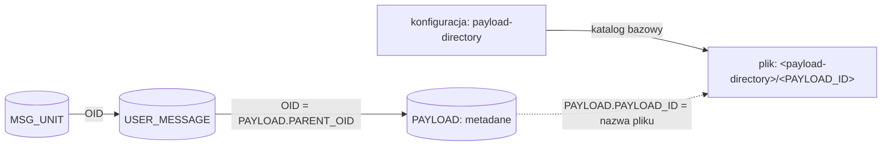
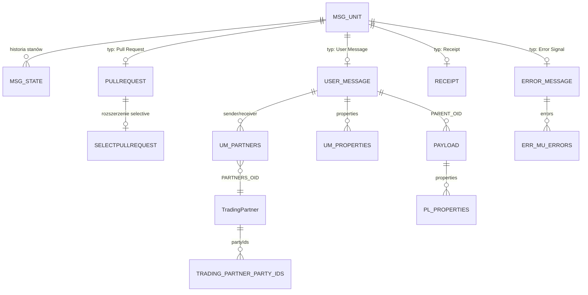

# Integracja z Holodeck B2B 7.0.0 przez bazę danych i system plików

## 1. Cel i zakres

Ten dokument jest źródłem wiedzy dla zespołu, który integruje się z działającą instancją Holodeck B2B wyłącznie przez:

1. odczyt metadanych z bazy Microsoft SQL Server;
2. odczyt treści payloadów z uzgodnionego katalogu w systemie plików.

Do korzystania z dokumentu nie jest potrzebna znajomość kodu, klas ani mechanizmów wewnętrznych Holodecka. Opisane niżej tabele, wartości i kolejność operacji należy traktować jako kontrakt danych dla wersji 7.0.0. Stan analizy: 2026-07-22.

Najważniejsza zasada: baza zawiera **metadane wiadomości i payloadów, ale nie zawiera treści payloadów**. Treść znajduje się w systemie plików, a elementem łączącym oba źródła jest `PAYLOAD.PAYLOAD_ID`. Sam odczyt SQL nie wystarcza do odtworzenia kompletnej wiadomości biznesowej.

Integracja opisana w tym dokumencie jest tylko do odczytu. Schemat bazy nie jest publicznym, wersjonowanym API i może zmienić się wraz z aktualizacją Holodecka. Zalecanym punktem dostępu są kontrolowane widoki integracyjne oraz katalog payloadów udostępniony z prawami tylko do odczytu.

### Źródła prawdy

Dla konkretnego wdrożenia obowiązuje następująca kolejność:

1. aktywna baza danych określa faktyczny schemat i dostępne metadane;
2. aktywna konfiguracja wdrożenia określa właściwy katalog payloadów;
3. zawartość tego katalogu określa dostępność treści;
4. ten dokument opisuje sposób korelacji danych i oczekiwane reguły ich interpretacji.

Rozbieżność pomiędzy dokumentem a wdrożeniem należy wyjaśnić przed uruchomieniem lub wznowieniem integracji. Nie wolno zgadywać nazwy schematu ani katalogu na podstawie wartości domyślnych.

### W skrócie

- Źródło metadanych: Microsoft SQL Server.
- Źródło treści: uzgodniony katalog payloadów w systemie plików.
- Łącznik: `PAYLOAD.PAYLOAD_ID`, równy nazwie pliku bez rozszerzenia.
- Główny rekord wiadomości: `MSG_UNIT`; konkretny typ wynika z obecności rekordu w tabeli potomnej.
- Aktualny stan: rekord `MSG_STATE` o największym `PROC_STATE_NUM` dla danej wiadomości.
- `MSG_UNIT.DIRECTION` jest liczbą: `0 = IN`, `1 = OUT`. `PAYLOAD.DIRECTION` jest tekstem: `IN` albo `OUT`.
- `MESSAGE_ID` nie jest unikalny. Integracja musi tolerować wiele rekordów o tej samej wartości.
- `CORE_ID` identyfikuje instancję wiadomości, ale baza nie wymusza jego unikalności.
- Zapis i usuwanie w bazie oraz w systemie plików nie są atomowe; integracja musi obsługiwać brakujące i osierocone pliki.
- Domyślna retencja wynosi 30 dni i może usuwać także wiadomości w stanie niefinalnym.
- Bezpośrednie modyfikowanie tabel lub plików jest poza kontraktem tej integracji.

## 2. Kontrakt przechowywania

Kompletna wiadomość jest rozdzielona pomiędzy dwa niezależne źródła:

1. **bazę danych** — przechowuje metadane wiadomości, historię stanów, metadane payloadów oraz relacje pomiędzy rekordami;
2. **system plików** — przechowuje binarną lub tekstową treść payloadów.

Nie istnieje wspólna transakcja obejmująca oba źródła. W rezultacie, chwilowo lub trwale po awarii, może istnieć:

- rekord `PAYLOAD` bez odpowiadającego pliku;
- plik bez odpowiadającego rekordu `PAYLOAD`;
- wiadomość w stanie `FAILURE`, jeżeli nie udało się zapisać kompletnego zestawu danych.

Domyślna lokalizacja treści to:

```text
<katalog tymczasowy Holodecka>/pldata/<PAYLOAD_ID>
```

Wartość `payload-directory` może wskazywać inny katalog. Integracja musi otrzymać jego rzeczywistą wartość od administratora wdrożenia. Nazwa pliku jest dokładnie wartością `PAYLOAD_ID`, bez rozszerzenia. `PAYLOAD.URI` nie jest lokalną ścieżką pliku i nie może służyć do jego odnalezienia.

### Relacja bazy danych z systemem plików

Jedynym łącznikiem pomiędzy SQL Serverem a systemem plików jest `PAYLOAD.PAYLOAD_ID`. Nie jest to klucz obcy ani relacja wymuszana przez bazę. Integracja odnajduje treść, używając tej wartości jako nazwy pliku w uzgodnionym katalogu payloadów.



Dla payloadu należącego do User Message pełna ścieżka korelacji ma postać:

```text
MSG_UNIT.OID
  -> USER_MESSAGE.OID
  -> PAYLOAD.PARENT_OID
  -> PAYLOAD.PAYLOAD_ID
  -> <payload-directory>/<PAYLOAD_ID>
```

| Aspekt | Baza danych | System plików |
|---|---|---|
| Identyfikacja | `PAYLOAD.PAYLOAD_ID` | Nazwa pliku równa `PAYLOAD_ID` |
| Zawartość | Metadane, m.in. rodzic, MIME type, containment i properties | Surowa treść payloadu |
| Lokalizacja | Katalog bazowy nie jest przechowywany w tabeli `PAYLOAD` | Katalog pochodzi z `payload-directory` albo z domyślnego `<temp>/pldata` |
| Integralność | `PAYLOAD_ID` jest unikalny w SQL, ale baza nie sprawdza istnienia pliku | System plików nie sprawdza istnienia rekordu `PAYLOAD` |

Docelowo jednemu rekordowi `PAYLOAD` odpowiada jeden plik, ale jest to logiczna relacja `1 : 1`, a nie gwarancja techniczna. Przy zapisie najpierw utrwalane są metadane, a potem treść; przy usuwaniu najpierw usuwany jest plik, a potem metadane. Dlatego integracja oraz procedury backup/restore muszą rozpoznawać oba rodzaje niespójności:

| Rekord `PAYLOAD` | Plik | Interpretacja |
|:---:|:---:|---|
| jest | jest | Stan spójny |
| jest | brak | Metadane bez treści; odczyt payloadu nie powiedzie się |
| brak | jest | Osierocony plik, którego nie da się powiązać z wiadomością przez SQL |

Relacja nazwa pliku = `PAYLOAD_ID` obowiązuje tylko wtedy, gdy dane wdrożenie udostępnia payloady w opisanym katalogu. Jeżeli treść jest przechowywana w innym magazynie, część dokumentu dotycząca systemu plików nie ma zastosowania i sposób pobierania treści musi zostać uzgodniony oddzielnie.

### Minimalny kontrakt dostępu

Przed uruchomieniem integracja musi otrzymać i zweryfikować:

| Element | Wymagana informacja lub uprawnienie |
|---|---|
| SQL Server | Adres serwera, nazwa bazy, szyfrowane połączenie i konto tylko do odczytu |
| Schemat SQL | Faktyczna nazwa schematu zawierającego opisane tabele; zwykle `dbo`, ale nie należy tego zakładać |
| Katalog payloadów | Bezwzględna ścieżka lokalna albo ścieżka udziału sieciowego odpowiadająca tej samej instancji Holodecka |
| Dostęp do plików | Prawo odczytu plików i listowania katalogu, bez prawa zapisu lub usuwania |
| Wersja danych | Wersja Holodecka oraz zaakceptowany snapshot schematu bazy |
| Retencja | Okres retencji bazy i plików oraz sposób informowania o usunięciach |

Zmienne `HB2B_DB_URL`, `HB2B_DB_USER` i `HB2B_DB_PASSWORD` opisują połączenie używane przez Holodeck, ale konto integracyjne powinno być odrębne i mieć wyłącznie prawa odczytu. Schemat może zostać rozszerzony podczas aktualizacji lub startu aplikacji, dlatego integracja nie może traktować samej wersji dokumentu jako dowodu stanu aktywnej bazy.

## 3. Model logiczny

### Rozpoznawanie typów wiadomości

Typ wiadomości nie jest zapisany w jednej kolumnie. Każdy typ ma rekord w `MSG_UNIT` oraz rekord z tym samym `OID` w odpowiedniej tabeli potomnej:

| Typ logiczny | Wymagane rekordy |
|---|---|
| User Message | `MSG_UNIT` + `USER_MESSAGE` |
| Error Signal | `MSG_UNIT` + `ERROR_MESSAGE` |
| Receipt Signal | `MSG_UNIT` + `RECEIPT` |
| Pull Request | `MSG_UNIT` + `PULLREQUEST`, bez `SELECTPULLREQUEST` |
| Selective Pull Request | `MSG_UNIT` + `PULLREQUEST` + `SELECTPULLREQUEST` |

Nie ma kolumny discriminatora. Integracja rozpoznaje typ na podstawie obecności rekordów w tabelach potomnych. Należy najpierw sprawdzić `SELECTPULLREQUEST`, a dopiero potem zwykły `PULLREQUEST`.

### Diagram ER



W diagramie `o|` przy tabelach potomnych oznacza relację oczekiwaną przez kontrakt. Baza nie ma ograniczenia, które wymusza dokładnie jeden typ potomny dla każdego `MSG_UNIT` ani zabrania sprzecznych rekordów kilku typów.

### Identyfikatory

| Identyfikator | Zakres i semantyka |
|---|---|
| `OID` | Techniczny `bigint` używany do tworzenia relacji wewnątrz tej bazy. Nie należy wystawiać go jako trwałego identyfikatora poza integracją z konkretną instancją bazy. |
| `CORE_ID` | UUID instancji wiadomości. Jest najlepszym identyfikatorem do korelacji rekordów jednej wiadomości, ale baza nie ma ograniczeń `UNIQUE` ani `NOT NULL`. |
| `MESSAGE_ID` | Identyfikator ebMS widoczny w protokole. Może występować wiele razy, szczególnie dla `DIRECTION=IN`. |
| `PAYLOAD_ID` | UUID łączący metadane payloadu z jego treścią. Jest unikalny w bazie i stanowi nazwę pliku w katalogu payloadów. |
| `PMODE_ID` | ID P-Mode wybranego do przetwarzania. To logiczne odwołanie do konfiguracji poza bazą; brak tabeli i FK. |

Wartości `OID` dla `MSG_UNIT`, `PAYLOAD` i `TradingPartner` pochodzą ze wspólnej sekwencji, dlatego przerwy i przeplatanie wartości są normalne. Nie wolno zakładać ciągłości ani liczby rekordów na podstawie różnicy identyfikatorów.

## 4. Model stanu przetwarzania

Stan nie jest nadpisywany w `MSG_UNIT`. Każda zmiana dodaje element do kolekcji `MSG_STATE`:

- `PROC_STATE_NUM` zaczyna się od `0` i rośnie o 1 w ramach jednego `MSGUNIT_OID`;
- `START` jest czasem nadanym przez zegar instancji Holodecka, a nie przez SQL Server;
- `DESCRIPTION` ma maksymalnie 255 znaków;
- aktualny stan to wiersz o największym `PROC_STATE_NUM`, nie największym `START`;
- kolejność globalna pomiędzy wiadomościami nie istnieje.

W poprawnych danych para `(MSGUNIT_OID, PROC_STATE_NUM)` jest logicznie unikalna, ale DDL nie ma dla niej `PRIMARY KEY` ani `UNIQUE`. Integracja powinna monitorować naruszenia tej reguły. Przy duplikacie najwyższego numeru stanu zwykłe zapytanie z `MAX(PROC_STATE_NUM)` może zwrócić więcej niż jeden aktualny stan.

### Wartości `STATE`

Kolumna przechowuje tekstową wartość z poniższej listy, z zachowaniem wielkich liter:

| Stan | Finalny | Znaczenie integracyjne |
|---|:---:|---|
| `SUBMITTED` | nie | Wiadomość użytkownika lub Pull Request przyjęty do wysłania. |
| `CREATED` | nie | Signal utworzony wewnętrznie przez Holodeck. |
| `RECEIVED` | nie | Pierwszy stan odebranej wiadomości. |
| `AWAITING_PULL` | nie | Wiadomość czeka na pobranie przez drugi MSH. |
| `READY_TO_PUSH` | nie | Wiadomość gotowa do wysłania push. |
| `PROCESSING` | nie | Trwa przetwarzanie. |
| `SENDING` | nie | Trwa transfer do drugiego MSH. Każde wystąpienie liczy się jako próba transmisji. |
| `TRANSPORT_FAILURE` | nie | Problem transportowy; możliwa dalsza obsługa/retry. |
| `AWAITING_RECEIPT` | nie | Oczekiwanie na Receipt. |
| `READY_FOR_DELIVERY` | nie | Gotowe do dostarczenia/notyfikacji aplikacji biznesowej. |
| `OUT_FOR_DELIVERY` | nie | Trwa dostarczenie/notyfikacja. |
| `DELIVERY_FAILED` | nie | Próba dostarczenia nie udała się. |
| `WARNING` | nie | Ostrzeżenie niekończące przetwarzania. |
| `SUSPENDED` | nie | Przetwarzanie wstrzymane, potencjalnie do wznowienia. |
| `DELIVERED` | tak | User Message dostarczony do MSH lub aplikacji biznesowej. |
| `DONE` | tak | Signal zakończony poprawnie. |
| `FAILURE` | tak | Trwale niepowodzenie przetwarzania. |
| `DUPLICATE` | tak | Odebrany User Message uznany za duplikat. |

Nie należy wyprowadzać sukcesu tylko z faktu, że stan jest finalny. `FAILURE` i `DUPLICATE` są finalne, ale nie oznaczają sukcesu biznesowego.

## 5. Słownik tabel i kolumn

Poniższy słownik opisuje referencyjny schemat SQL Servera dla analizowanej wersji. Rzeczywista instancja może mieć dodatkowe starsze kolumny, inne nazwy constraintów albo ręcznie dodane indeksy. Przed wdrożeniem integracji trzeba porównać katalog systemowy z tym dokumentem za pomocą zapytań z sekcji 13.

`NULL` w kolumnie „Wymagane” oznacza, że baza dopuszcza `NULL`, nawet jeżeli znaczenie biznesowe pola sugeruje wartość obowiązkową.

### `MSG_UNIT`

Wspólna część każdej wiadomości.

| Kolumna | Typ SQL | Wymagane | Znaczenie |
|---|---|:---:|---|
| `OID` | `bigint` | PK | Techniczny klucz z `hibernate_sequence`. |
| `VERSION` | `bigint` | tak | Lokalny licznik zmian jednego `MSG_UNIT`. Zwiększa się przy aktualizacji; nie jest globalnym numerem zmiany ani offsetem do odczytu przyrostowego. |
| `CORE_ID` | `varchar(255)` | NULL | UUID nadany przez Holodeck. |
| `DIRECTION` | `int` | NULL | Kod liczbowy: `0=IN`, `1=OUT`. Inne wartości są nieprawidłowe. |
| `MESSAGE_ID` | `varchar(255)` | NULL | ebMS MessageId; nie jest unikalny. |
| `MU_TIMESTAMP` | `datetime2` | NULL | Czas wiadomości. Bez informacji o strefie czasowej. |
| `PMODE_ID` | `varchar(255)` | NULL | P-Mode wybrany do przetwarzania. |
| `REF_TO_MSG_ID` | `varchar(255)` | NULL | Logiczne odwołanie do `MESSAGE_ID`, bez FK. |
| `USES_MULTI_HOP` | `bit` | tak | Flaga multi-hop. Oczekiwana wartość początkowa to `false`; DDL nie definiuje `DEFAULT`. |

`DIRECTION`, `MESSAGE_ID`, `CORE_ID` i `PMODE_ID` mają duże znaczenie domenowe, ale ich poprawność nie jest wymuszana constraintami.

### `MSG_STATE`

Historia stanów wszystkich typów wiadomości.

| Kolumna | Typ SQL | Wymagane | Znaczenie |
|---|---|:---:|---|
| `MSGUNIT_OID` | `bigint` | FK | Odbiorca historii, FK do `MSG_UNIT.OID`. |
| `PROC_STATE_NUM` | `int` | tak | Numer kolejny w ramach wiadomości, liczony od `0`. |
| `STATE` | `varchar(255)` | NULL | Tekstowa wartość `ProcessingState`. |
| `START` | `datetime2` | NULL | Początek stanu według zegara instancji Holodecka, a nie SQL Servera. |
| `DESCRIPTION` | `varchar(255)` | NULL | Dodatkowy opis diagnostyczny. |

Brak klucza głównego i indeksu w bazowym DDL. Integracja musi zawsze jawnie sortować historię po `PROC_STATE_NUM`.

### `USER_MESSAGE`

Dane ebMS User Message. `OID` jest jednocześnie PK i FK do `MSG_UNIT.OID`.

| Kolumna | Typ SQL | Wymagane | Znaczenie |
|---|---|:---:|---|
| `OID` | `bigint` | PK/FK | Wspólny identyfikator z `MSG_UNIT`. |
| `MPC` | `varchar(max)` | NULL | Message Partition Channel. Domyślna wartość aplikacyjna: `http://docs.oasis-open.org/ebxml-msg/ebms/v3.0/ns/core/200704/defaultMPC`. |
| `CI_ACTION` | `varchar(max)` | NULL | `CollaborationInfo/Action`. |
| `CONVERSATION_ID` | `varchar(max)` | NULL | Identyfikator konwersacji biznesowej. |
| `S_NAME` | `varchar(max)` | NULL | Nazwa serwisu. |
| `S_TYPE` | `varchar(max)` | NULL | Typ serwisu. |
| `A_NAME` | `varchar(255)` | NULL | Nazwa AgreementRef. |
| `A_TYPE` | `varchar(255)` | NULL | Typ AgreementRef. |
| `P_MODE_ID` | `varchar(255)` | NULL | P-Mode ID zawarty w AgreementRef. Nie mylić z `MSG_UNIT.PMODE_ID`. |

`MSG_UNIT.PMODE_ID` opisuje P-Mode użyty do przetwarzania przez instancję Holodecka. `USER_MESSAGE.P_MODE_ID` jest częścią danych protokołowych AgreementRef i może być puste lub mieć inną wartość.

### `UM_PARTNERS`

Tabela łącząca User Message z osobnymi encjami nadawcy i odbiorcy.

| Kolumna | Typ SQL | Wymagane | Znaczenie |
|---|---|:---:|---|
| `USER_MESSAGE_OID` | `bigint` | PK/FK | FK do `USER_MESSAGE.OID`. |
| `PARTNERTYPE` | `varchar(255)` | PK | `SENDER` lub `RECEIVER`. |
| `PARTNERS_OID` | `bigint` | FK/UNIQUE | FK do `TradingPartner.OID`; partner należy tylko do jednej wiadomości. |

PK `(USER_MESSAGE_OID, PARTNERTYPE)` wymusza maksymalnie jednego partnera dla danego tekstowego typu, ale CHECK nie ogranicza wartości do `SENDER`/`RECEIVER`.

### `TradingPartner`

Instancja partnera jest prywatna dla jednej wiadomości, nawet gdy ten sam podmiot występuje w wielu wiadomościach.

| Kolumna | Typ SQL | Wymagane | Znaczenie |
|---|---|:---:|---|
| `OID` | `bigint` | PK | Techniczny klucz z `hibernate_sequence`. |
| `TP_ROLE` | `varchar(max)` | NULL | Rola ebMS Party. |

Nie należy traktować `TradingPartner` jako kartoteki kontrahentów ani łączyć rekordów po `OID` pomiędzy wiadomościami.

### `TRADING_PARTNER_PARTY_IDS`

Lista identyfikatorów partnera.

| Kolumna | Typ SQL | Wymagane | Znaczenie |
|---|---|:---:|---|
| `TRADING_PARTNER_OID` | `bigint` | FK | FK do `TradingPartner.OID`. |
| `P_ID` | `varchar(max)` | NULL | Identyfikator PartyId. Domenowo wymagany, ale nie przez DDL. |
| `P_TYPE` | `varchar(max)` | NULL | Typ PartyId. |

Brak PK, kolejności i ograniczenia duplikatów.

### `UM_PROPERTIES`

Dowolne właściwości User Message.

| Kolumna | Typ SQL | Wymagane | Znaczenie |
|---|---|:---:|---|
| `USER_MESSAGE_OID` | `bigint` | FK | FK do `USER_MESSAGE.OID`. |
| `NAME` | `varchar(max)` | NULL | Nazwa property. |
| `VALUE` | `varchar(max)` | NULL | Wartość property. |
| `TYPE` | `varchar(max)` | NULL | Opcjonalny typ wartości. |

Nazwa nie jest unikalna; poprawna wiadomość może mieć wiele property o tej samej nazwie. Brak gwarantowanej kolejności.

### `PAYLOAD`

Metadane payloadu. Rekord może istnieć samodzielnie przed podpięciem do User Message.

| Kolumna | Typ SQL | Wymagane | Znaczenie |
|---|---|:---:|---|
| `OID` | `bigint` | PK | Techniczny klucz. |
| `PAYLOAD_ID` | `varchar(255)` | UNIQUE, NULL | UUID i klucz do treści w systemie plików. SQL Server pozwala na maksymalnie jeden `NULL` w zwykłym indeksie unique. W poprawnych danych operacyjnych oczekiwany jest UUID. |
| `PARENT_OID` | `bigint` | NULL/FK | FK do `USER_MESSAGE.OID`; `NULL` dla payloadu złożonego osobno. |
| `DIRECTION` | `varchar(255)` | NULL | `IN`/`OUT` dla payloadu samodzielnego. Dla podpiętego payloadu wartość efektywna pochodzi z rodzica. |
| `PMODE_ID` | `varchar(255)` | NULL | P-Mode payloadu samodzielnego. Dla podpiętego payloadu wartość efektywna pochodzi z rodzica. |
| `CONTAINMENT` | `varchar(255)` | NULL | `BODY`, `ATTACHMENT` albo `EXTERNAL`. |
| `URI` | `varchar(255)` | NULL | URI payloadu w kontekście wiadomości; nie lokalna ścieżka. |
| `MIME_TYPE` | `varchar(255)` | NULL | Typ MIME, jeżeli był dostępny. |
| `DESCRIPTION` | `varchar(max)` | NULL | Przestarzały opis payloadu; wartości tworzone przez Holodeck mają maksymalnie 10000 znaków. |
| `LANG` | `varchar(255)` | NULL | Język opisu. |
| `LOCATION` | `varchar(max)` | NULL | Lokalizacja schematu dokumentu. |
| `NAMESPACE` | `varchar(max)` | NULL | Namespace schematu. |
| `VERSION` | `varchar(max)` | NULL | Wersja schematu dokumentu; to nie jest licznik blokady. |

`PAYLOAD` nie ma licznika zmian odpowiadającego `MSG_UNIT.VERSION`. Nie należy więc używać tej tabeli samodzielnie do wykrywania wszystkich aktualizacji; równoległe zmiany mogą mieć semantykę last-write-wins.

Integracja musi wyliczać wartości efektywne według następującej reguły:

```text
effective direction = parent exists ? MSG_UNIT.DIRECTION : PAYLOAD.DIRECTION
effective P-Mode    = parent exists ? MSG_UNIT.PMODE_ID   : PAYLOAD.PMODE_ID
parent core ID      = parent exists ? MSG_UNIT.CORE_ID    : NULL
```

### `PL_PROPERTIES`

Dowolne właściwości payloadu.

| Kolumna | Typ SQL | Wymagane | Znaczenie |
|---|---|:---:|---|
| `PAYLOAD_OID` | `bigint` | FK | FK do `PAYLOAD.OID`. |
| `NAME` | `varchar(max)` | NULL | Nazwa property. |
| `VALUE` | `varchar(max)` | NULL | Wartość property. |
| `TYPE` | `varchar(max)` | NULL | Opcjonalny typ wartości. |

Brak PK, kolejności i ograniczenia duplikatów.

### `ERROR_MESSAGE`

Nagłówek Error Signal. `OID` jest PK i FK do `MSG_UNIT.OID`.

| Kolumna | Typ SQL | Wymagane | Znaczenie |
|---|---|:---:|---|
| `OID` | `bigint` | PK/FK | Wspólny identyfikator z `MSG_UNIT`. |
| `ADD_SOAP_FAULT` | `bit` | tak | Czy signal powinien być połączony z SOAP Fault; ostateczna decyzja zależy też od pakowania. |
| `LEG` | `varchar(255)` | NULL | `REQUEST` albo `REPLY`; może być `NULL` dla one-way MEP lub braku dopasowania. |

### `ERR_MU_ERRORS`

Poszczególne błędy ebMS należące do Error Signal.

| Kolumna | Typ SQL | Wymagane | Znaczenie |
|---|---|:---:|---|
| `ERROR_MESSAGE_OID` | `bigint` | FK | FK do `ERROR_MESSAGE.OID`. |
| `ERROR_CODE` | `varchar(255)` | NULL | Kod błędu, domenowo wymagany. |
| `SEVERITY` | `varchar(255)` | NULL | Dokładnie `warning` albo `failure` - małe litery. |
| `ERROR_MESSAGE` | `varchar(max)` | NULL | Krótki opis, do 1024 znaków według mapowania. |
| `ERROR_DETAIL` | `varchar(max)` | NULL | Szczegóły, do 10000 znaków według mapowania. |
| `ORIGIN` | `varchar(255)` | NULL | Moduł pochodzenia błędu. |
| `CATEGORY` | `varchar(255)` | NULL | Kategoria błędu. |
| `REF_TO_MSG_IN_ERROR` | `varchar(255)` | NULL | MessageId powodujący błąd; brak FK. |
| `DESCRIPTION_LANG` | `varchar(255)` | NULL | Język długiego opisu. |
| `DESCRIPTION_TXT` | `varchar(max)` | NULL | Długi opis, do 10000 znaków według mapowania. |

Brak PK i kolumny porządku. SQL nie gwarantuje kolejności błędów.

### `RECEIPT`

Receipt Signal. `OID` jest PK i FK do `MSG_UNIT.OID`.

| Kolumna | Typ SQL | Wymagane | Znaczenie |
|---|---|:---:|---|
| `OID` | `bigint` | PK/FK | Wspólny identyfikator z `MSG_UNIT`. |
| `CONTENT` | `varchar(max)` | NULL | Fragmenty XML Receipt opakowane przez aplikację w sztuczny element `<receipt_content>`. |

`CONTENT` jest serializowanym XML-em, a nie pojedynczym elementem Receipt. Parser integracji powinien obsłużyć wrapper i wiele dzieci. Wartości tworzone przez Holodeck nie powinny przekraczać 65535 znaków, chociaż SQL Server przechowuje je w `varchar(max)`.

### `PULLREQUEST`

Pull Request. `OID` jest PK i FK do `MSG_UNIT.OID`.

| Kolumna | Typ SQL | Wymagane | Znaczenie |
|---|---|:---:|---|
| `OID` | `bigint` | PK/FK | Wspólny identyfikator z `MSG_UNIT`. |
| `MPC` | `varchar(max)` | NULL | Kanał pobierany przez request. |

### `SELECTPULLREQUEST`

Rozszerzenie Selective Pull Request. Ten sam `OID` musi być obecny także w `PULLREQUEST` i `MSG_UNIT`.

| Kolumna | Typ SQL | Wymagane | Znaczenie |
|---|---|:---:|---|
| `OID` | `bigint` | PK/FK | FK do `PULLREQUEST.OID`. |
| `REFD_MESSAGE_ID` | `varchar(255)` | NULL | Selekcja po MessageId. |
| `CONVERSATION_ID` | `varchar(max)` | NULL | Selekcja po ConversationId. |
| `S_ACTION` | `varchar(max)` | NULL | Selekcja po Action. |
| `S_NAME` | `varchar(max)` | NULL | Nazwa serwisu. |
| `S_TYPE` | `varchar(max)` | NULL | Typ serwisu. |
| `A_NAME` | `varchar(255)` | NULL | Nazwa AgreementRef. |
| `A_TYPE` | `varchar(255)` | NULL | Typ AgreementRef. |
| `P_MODE_ID` | `varchar(255)` | NULL | P-Mode ID w AgreementRef selekcji. |

## 6. Klucze obce i constrainty

Nazwane elementy w bieżącym modelu:

| Constraint | Relacja / warunek |
|---|---|
| `UK_PAYLOAD_PAYLOAD_ID` | `PAYLOAD(PAYLOAD_ID)` unique |
| `UK_UM_PARTNERS_PARTNERS_OID` | `UM_PARTNERS(PARTNERS_OID)` unique |
| `FK_MSG_STATE_MSG_UNIT` | `MSG_STATE.MSGUNIT_OID -> MSG_UNIT.OID` |
| `FK_USER_MESSAGE_MSG_UNIT` | `USER_MESSAGE.OID -> MSG_UNIT.OID` |
| `FK_ERROR_MESSAGE_MSG_UNIT` | `ERROR_MESSAGE.OID -> MSG_UNIT.OID` |
| `FK_RECEIPT_MSG_UNIT` | `RECEIPT.OID -> MSG_UNIT.OID` |
| `FK_PULLREQUEST_MSG_UNIT` | `PULLREQUEST.OID -> MSG_UNIT.OID` |
| `FK_SELECTPULLREQUEST_PULLREQUEST` | `SELECTPULLREQUEST.OID -> PULLREQUEST.OID` |
| `FK_PAYLOAD_USER_MESSAGE` | `PAYLOAD.PARENT_OID -> USER_MESSAGE.OID` |
| `FK_PL_PROPERTIES_PAYLOAD` | `PL_PROPERTIES.PAYLOAD_OID -> PAYLOAD.OID` |
| `FK_ERR_MU_ERRORS_ERROR_MESSAGE` | `ERR_MU_ERRORS.ERROR_MESSAGE_OID -> ERROR_MESSAGE.OID` |
| `FK_UM_PARTNERS_USER_MESSAGE` | `UM_PARTNERS.USER_MESSAGE_OID -> USER_MESSAGE.OID` |
| `FK_UM_PARTNERS_TRADING_PARTNER` | `UM_PARTNERS.PARTNERS_OID -> TradingPartner.OID` |
| `FK_TRADING_PARTNER_PARTY_IDS_TRADING_PARTNER` | `TRADING_PARTNER_PARTY_IDS.TRADING_PARTNER_OID -> TradingPartner.OID` |
| `FK_UM_PROPERTIES_USER_MESSAGE` | `UM_PROPERTIES.USER_MESSAGE_OID -> USER_MESSAGE.OID` |

Żaden z nich nie ma `ON DELETE CASCADE`. SQL Server nie tworzy automatycznie indeksu dla każdego FK. Obsługiwany proces retencji usuwa rekordy zależne we właściwej kolejności. Ręczne `DELETE FROM MSG_UNIT` jest poza kontraktem, może pozostawić pliki payloadów i najczęściej zostanie zablokowane przez FK.

## 7. Wartości słownikowe i kodowanie typów

| Miejsce | Reprezentacja | Dopuszczalne wartości |
|---|---|---|
| `MSG_UNIT.DIRECTION` | `int` | `0=IN`, `1=OUT` |
| `PAYLOAD.DIRECTION` | tekst | `IN`, `OUT` |
| `MSG_STATE.STATE` | tekst | lista z sekcji 4 |
| `PAYLOAD.CONTAINMENT` | tekst | `BODY`, `ATTACHMENT`, `EXTERNAL` |
| `UM_PARTNERS.PARTNERTYPE` | tekst | `SENDER`, `RECEIVER` |
| `ERROR_MESSAGE.LEG` | tekst | `REQUEST`, `REPLY` |
| `ERR_MU_ERRORS.SEVERITY` | tekst | `warning`, `failure` |

DDL nie ma `CHECK` dla tych list wartości. Nieznana wartość jest nieprawidłowa i może uniemożliwić poprawny odczyt całej wiadomości.

Wszystkie teksty w referencyjnym DDL są `varchar`, nie `nvarchar`. Porównania, sortowanie, wrażliwość na wielkość liter i obsługa znaków spoza strony kodowej wynikają z collation bazy/kolumn. Należy to sprawdzić przed integracją z wielojęzycznymi danymi.

## 8. Cykl życia danych widoczny dla integracji

Ta sekcja opisuje kolejność i stany, które integracja może zaobserwować w bazie i systemie plików. Nie wymaga znajomości sposobu ich realizacji wewnątrz Holodecka.

### Tworzenie wiadomości

1. Odebrana wiadomość ma `DIRECTION=IN`, a jej pierwszym stanem jest `RECEIVED`.
2. Wysyłana wiadomość ma `DIRECTION=OUT`.
3. Wychodzący User Message i Pull Request bez wcześniejszej historii otrzymują `SUBMITTED`; tworzone Signale otrzymują `CREATED`.
4. Dla wychodzącej wiadomości oczekiwane są niepuste `MESSAGE_ID`, `MU_TIMESTAMP` i `CORE_ID`.
5. `MESSAGE_ID` wiadomości przychodzących może się powtarzać. Jest to prawidłowe i służy do rozpoznawania duplikatów.
6. Dla wiadomości wychodzących oczekiwany jest unikalny `MESSAGE_ID`, ale baza tego nie wymusza. Równoległe operacje mogą więc utworzyć duplikat.

Integracja nie może wybierać jednego rekordu wyłącznie po `MESSAGE_ID`. Do identyfikacji konkretnej instancji należy używać `CORE_ID`, a ewentualne duplikaty `CORE_ID` monitorować jako naruszenie integralności.

### Aktualizacje i współbieżność

`MSG_UNIT.VERSION` jest lokalnym licznikiem zmian jednej wiadomości:

- zmiana rekordu `MSG_UNIT` zwykle zwiększa `VERSION`;
- licznik nie porządkuje zmian pomiędzy różnymi wiadomościami;
- nie obejmuje samodzielnie wszystkich zmian tabel zależnych ani plików;
- bezpośredni zapis SQL może ominąć kontrolę współbieżności i uszkodzić historię stanów.

Odczyt z wielu tabel wykonany w niezależnych zapytaniach może połączyć wersje danych z różnych chwil. Dla spójnego obrazu integracja powinna używać jednej transakcji odczytowej z odpowiednim poziomem izolacji. Nie należy używać `WITH (NOLOCK)`, ponieważ może zwrócić brudne dane, brakujące rekordy zależne, podwojone wiersze albo częściowo zmienioną kolekcję.

Aktualizacja tabel kolekcji, takich jak `UM_PROPERTIES`, `PL_PROPERTIES`, `ERR_MU_ERRORS` i `TRADING_PARTNER_PARTY_IDS`, może być widoczna w CDC jako seria `DELETE` i `INSERT`. Zmiany tych tabel należy interpretować jako nowy snapshot kolekcji właściciela, a nie stabilny strumień zdarzeń element po elemencie.

### Payload zapisany przed wiadomością

Payload może pojawić się przed powiązaniem go z User Message:

1. Powstaje rekord `PAYLOAD` z `PARENT_OID=NULL`, `DIRECTION='OUT'` i `PMODE_ID`.
2. Treść jest zapisywana w pliku nazwanym wartością `PAYLOAD_ID`.
3. Podczas zapisu User Message istniejący payload jest odnajdywany po `PAYLOAD_ID`.
4. Jeżeli payload nie ma rodzica, a kierunek i P-Mode są zgodne z wiadomością, ustawiany jest `PARENT_OID`.

Z tego powodu rekord `PAYLOAD` z `PARENT_OID=NULL` nie musi być osierocony — może oczekiwać na powiązanie. Payload utworzony od razu jako część wiadomości może mieć puste `PAYLOAD.DIRECTION` i `PAYLOAD.PMODE_ID`. Integracja musi wtedy stosować regułę wartości efektywnej z sekcji `PAYLOAD`.

### Usuwanie i retencja

Domyślny proces retencji:

- startuje po 60 sekundach;
- uruchamia się co 3600 sekund;
- bez parametru `purgeAfterDays` przyjmuje 30 dni;
- wybiera wiadomości, dla których czas `START` **aktualnego** stanu jest starszy niż granica retencji lub jej równy;
- nie filtruje stanów finalnych;
- dla User Message najpierw usuwa pliki payloadów, a potem metadane z bazy.

Konsekwencje:

- długo zawieszona lub oczekująca wiadomość może zostać usunięta mimo stanu niefinalnego;
- integracja musi obsługiwać fizyczne znikanie rekordów i plików;
- gdy usunięcie pliku nie powiedzie się, metadane pozostają do kolejnej próby;
- gdy pliki zostaną usunięte, a późniejsze usunięcie SQL nie powiedzie się, metadane mogą wskazywać na nieistniejącą treść;
- bezpośrednie skasowanie SQL nie usunie plików i naruszy kontrakt retencji.

Okres retencji ustala administrator wdrożenia. Wartość domyślna to 30 dni, ale może zostać zmieniona parametrem `purgeAfterDays`. Integracja musi otrzymać rzeczywistą wartość jako część kontraktu operacyjnego; nie powinna odczytywać jej pośrednio ani zakładać wartości domyślnej.

## 9. Bezpieczne zapytania T-SQL

Przykłady zakładają schemat `dbo`. Jeżeli domyślny schemat użytkownika Holodecka jest inny, należy zmienić kwalifikatory. Wartości takie jak `@message_id` muszą być przekazywane jako parametry zapytania przez sterownik bazy, a nie składane przez konkatenację.

### 9.1 Aktualny stan i typ każdej wiadomości

```sql
WITH ranked_state AS (
    SELECT
        s.MSGUNIT_OID,
        s.PROC_STATE_NUM,
        s.STATE,
        s.START,
        s.DESCRIPTION,
        ROW_NUMBER() OVER (
            PARTITION BY s.MSGUNIT_OID
            ORDER BY s.PROC_STATE_NUM DESC, s.START DESC
        ) AS rn
    FROM dbo.MSG_STATE AS s
)
SELECT
    mu.OID,
    mu.CORE_ID,
    mu.MESSAGE_ID,
    CASE mu.DIRECTION WHEN 0 THEN 'IN' WHEN 1 THEN 'OUT' ELSE 'INVALID' END AS DIRECTION,
    mu.MU_TIMESTAMP,
    mu.PMODE_ID,
    mu.REF_TO_MSG_ID,
    mu.VERSION,
    CASE
        WHEN um.OID IS NOT NULL THEN 'USER_MESSAGE'
        WHEN em.OID IS NOT NULL THEN 'ERROR_MESSAGE'
        WHEN r.OID IS NOT NULL THEN 'RECEIPT'
        WHEN spr.OID IS NOT NULL THEN 'SELECTIVE_PULL_REQUEST'
        WHEN pr.OID IS NOT NULL THEN 'PULL_REQUEST'
        ELSE 'UNKNOWN'
    END AS MESSAGE_TYPE,
    cs.STATE AS CURRENT_STATE,
    cs.START AS CURRENT_STATE_SINCE,
    cs.DESCRIPTION AS CURRENT_STATE_DESCRIPTION
FROM dbo.MSG_UNIT AS mu
LEFT JOIN ranked_state AS cs
    ON cs.MSGUNIT_OID = mu.OID AND cs.rn = 1
LEFT JOIN dbo.USER_MESSAGE AS um ON um.OID = mu.OID
LEFT JOIN dbo.ERROR_MESSAGE AS em ON em.OID = mu.OID
LEFT JOIN dbo.RECEIPT AS r ON r.OID = mu.OID
LEFT JOIN dbo.PULLREQUEST AS pr ON pr.OID = mu.OID
LEFT JOIN dbo.SELECTPULLREQUEST AS spr ON spr.OID = mu.OID;
```

`ROW_NUMBER` daje jeden rekord nawet przy uszkodzonych duplikatach numeru stanu. Duplikaty należy jednak wykrywać osobnym zapytaniem kontrolnym, a nie na stałe maskować w widoku integracyjnym.

### 9.2 Historia konkretnej wiadomości

```sql
SELECT
    mu.CORE_ID,
    mu.MESSAGE_ID,
    s.PROC_STATE_NUM,
    s.STATE,
    s.START,
    s.DESCRIPTION
FROM dbo.MSG_UNIT AS mu
JOIN dbo.MSG_STATE AS s ON s.MSGUNIT_OID = mu.OID
WHERE mu.CORE_ID = @core_id
ORDER BY s.PROC_STATE_NUM;
```

`START` nie jest wystarczający do sortowania; dwa stany mogą mieć ten sam czas.

### 9.3 User Message z danymi biznesowymi

```sql
SELECT
    mu.OID,
    mu.CORE_ID,
    mu.MESSAGE_ID,
    CASE mu.DIRECTION WHEN 0 THEN 'IN' WHEN 1 THEN 'OUT' END AS DIRECTION,
    mu.MU_TIMESTAMP,
    mu.PMODE_ID AS RUNTIME_PMODE_ID,
    um.MPC,
    um.CONVERSATION_ID,
    um.CI_ACTION AS ACTION,
    um.S_NAME AS SERVICE_NAME,
    um.S_TYPE AS SERVICE_TYPE,
    um.A_NAME AS AGREEMENT_NAME,
    um.A_TYPE AS AGREEMENT_TYPE,
    um.P_MODE_ID AS AGREEMENT_PMODE_ID
FROM dbo.MSG_UNIT AS mu
JOIN dbo.USER_MESSAGE AS um ON um.OID = mu.OID
WHERE mu.MESSAGE_ID = @message_id
ORDER BY mu.MU_TIMESTAMP, mu.OID;
```

Zapytanie celowo może zwrócić wiele wierszy. Jeżeli oczekiwany jest jeden rekord, należy użyć `CORE_ID`, a nie `MESSAGE_ID`, i nadal monitorować ewentualne duplikaty `CORE_ID`.

### 9.4 Nadawca, odbiorca i PartyId

```sql
SELECT
    mu.CORE_ID,
    up.PARTNERTYPE,
    tp.TP_ROLE,
    pid.P_ID,
    pid.P_TYPE
FROM dbo.MSG_UNIT AS mu
JOIN dbo.USER_MESSAGE AS um ON um.OID = mu.OID
JOIN dbo.UM_PARTNERS AS up ON up.USER_MESSAGE_OID = um.OID
JOIN dbo.TradingPartner AS tp ON tp.OID = up.PARTNERS_OID
LEFT JOIN dbo.TRADING_PARTNER_PARTY_IDS AS pid
    ON pid.TRADING_PARTNER_OID = tp.OID
WHERE mu.CORE_ID = @core_id
ORDER BY up.PARTNERTYPE, pid.P_ID;
```

Wiele PartyId partnera jest poprawne. Integracja nie powinna wybierać arbitralnie pierwszego bez uzgodnionej reguły opartej np. na `P_TYPE`.

### 9.5 Payloady z wartościami efektywnymi

```sql
SELECT
    p.OID,
    p.PAYLOAD_ID,
    p.PARENT_OID,
    mu.CORE_ID AS PARENT_CORE_ID,
    CASE
        WHEN p.PARENT_OID IS NOT NULL THEN
            CASE mu.DIRECTION WHEN 0 THEN 'IN' WHEN 1 THEN 'OUT' ELSE 'INVALID' END
        ELSE p.DIRECTION
    END AS EFFECTIVE_DIRECTION,
    CASE
        WHEN p.PARENT_OID IS NOT NULL THEN mu.PMODE_ID
        ELSE p.PMODE_ID
    END AS EFFECTIVE_PMODE_ID,
    p.CONTAINMENT,
    p.URI,
    p.MIME_TYPE,
    p.DESCRIPTION,
    p.LANG,
    p.LOCATION AS SCHEMA_LOCATION,
    p.NAMESPACE AS SCHEMA_NAMESPACE,
    p.VERSION AS SCHEMA_VERSION
FROM dbo.PAYLOAD AS p
LEFT JOIN dbo.USER_MESSAGE AS um ON um.OID = p.PARENT_OID
LEFT JOIN dbo.MSG_UNIT AS mu ON mu.OID = um.OID
WHERE mu.CORE_ID = @core_id OR p.PAYLOAD_ID = @payload_id;
```

Odczyt treści wymaga dostępu do uzgodnionego katalogu payloadów. Nie należy zakładać, że katalog jest lokalny, współdzielony ani dostępny pod ścieżką domyślną.

### 9.6 Error Signal i błędy ebMS

```sql
SELECT
    mu.CORE_ID,
    mu.MESSAGE_ID AS ERROR_SIGNAL_MESSAGE_ID,
    mu.REF_TO_MSG_ID,
    em.ADD_SOAP_FAULT,
    em.LEG,
    e.ERROR_CODE,
    e.SEVERITY,
    e.ERROR_MESSAGE,
    e.ERROR_DETAIL,
    e.ORIGIN,
    e.CATEGORY,
    e.REF_TO_MSG_IN_ERROR,
    e.DESCRIPTION_LANG,
    e.DESCRIPTION_TXT
FROM dbo.MSG_UNIT AS mu
JOIN dbo.ERROR_MESSAGE AS em ON em.OID = mu.OID
LEFT JOIN dbo.ERR_MU_ERRORS AS e ON e.ERROR_MESSAGE_OID = em.OID
WHERE mu.CORE_ID = @core_id;
```

`MSG_UNIT.REF_TO_MSG_ID` opisuje relację całego signalu, a `ERR_MU_ERRORS.REF_TO_MSG_IN_ERROR` relację pojedynczego błędu. Obie są tekstowe i nie mają FK.

### 9.7 Próby transmisji

Liczbę prób transmisji jednej instancji wiadomości można wyznaczyć następująco:

```sql
SELECT COUNT_BIG(*) AS TRANSMISSION_COUNT
FROM dbo.MSG_UNIT AS mu
JOIN dbo.USER_MESSAGE AS um ON um.OID = mu.OID
JOIN dbo.MSG_STATE AS s ON s.MSGUNIT_OID = mu.OID
WHERE mu.CORE_ID = @core_id
  AND s.STATE = 'SENDING';
```

Zapytanie używa `CORE_ID`, ponieważ `MESSAGE_ID` może wskazywać kilka rekordów i zsumować transmisje różnych instancji wiadomości.

### 9.8 Kontrole integralności

```sql
-- Brak lub wiele typów potomnych dla MSG_UNIT.
SELECT mu.OID, mu.CORE_ID,
       (CASE WHEN um.OID IS NULL THEN 0 ELSE 1 END
        + CASE WHEN em.OID IS NULL THEN 0 ELSE 1 END
        + CASE WHEN r.OID IS NULL THEN 0 ELSE 1 END
        + CASE WHEN pr.OID IS NULL THEN 0 ELSE 1 END) AS ROOT_TYPE_COUNT
FROM dbo.MSG_UNIT AS mu
LEFT JOIN dbo.USER_MESSAGE AS um ON um.OID = mu.OID
LEFT JOIN dbo.ERROR_MESSAGE AS em ON em.OID = mu.OID
LEFT JOIN dbo.RECEIPT AS r ON r.OID = mu.OID
LEFT JOIN dbo.PULLREQUEST AS pr ON pr.OID = mu.OID
WHERE (CASE WHEN um.OID IS NULL THEN 0 ELSE 1 END
       + CASE WHEN em.OID IS NULL THEN 0 ELSE 1 END
       + CASE WHEN r.OID IS NULL THEN 0 ELSE 1 END
       + CASE WHEN pr.OID IS NULL THEN 0 ELSE 1 END) <> 1;

-- Duplikaty logicznego numeru stanu.
SELECT MSGUNIT_OID, PROC_STATE_NUM, COUNT_BIG(*) AS CNT
FROM dbo.MSG_STATE
GROUP BY MSGUNIT_OID, PROC_STATE_NUM
HAVING COUNT_BIG(*) > 1;

-- Niepoprawne enumy.
SELECT OID, DIRECTION
FROM dbo.MSG_UNIT
WHERE DIRECTION IS NOT NULL AND DIRECTION NOT IN (0, 1);

SELECT DISTINCT STATE
FROM dbo.MSG_STATE
WHERE STATE IS NOT NULL
  AND STATE NOT IN (
      'SUBMITTED', 'CREATED', 'RECEIVED', 'AWAITING_PULL', 'READY_TO_PUSH',
      'PROCESSING', 'SENDING', 'TRANSPORT_FAILURE', 'AWAITING_RECEIPT',
      'READY_FOR_DELIVERY', 'OUT_FOR_DELIVERY', 'DELIVERY_FAILED', 'WARNING',
      'SUSPENDED', 'DELIVERED', 'DONE', 'FAILURE', 'DUPLICATE'
  );

-- Duplikaty CORE_ID i wychodzącego MESSAGE_ID.
SELECT CORE_ID, COUNT_BIG(*) AS CNT
FROM dbo.MSG_UNIT
WHERE CORE_ID IS NOT NULL
GROUP BY CORE_ID
HAVING COUNT_BIG(*) > 1;

SELECT MESSAGE_ID, COUNT_BIG(*) AS CNT
FROM dbo.MSG_UNIT
WHERE DIRECTION = 1 AND MESSAGE_ID IS NOT NULL
GROUP BY MESSAGE_ID
HAVING COUNT_BIG(*) > 1;
```

## 10. Strategia integracji odczytowej

### Zalecany kontrakt

Najstabilniejszy układ dla integracji przez bazę i system plików:

1. Oddzielne konto integracyjne ma tylko `SELECT` na zatwierdzonych widokach.
2. Widoki znajdują się w osobnym schemacie, np. `integration`, i zwracają nazwy domenowe zamiast surowych wartości liczbowych.
3. Widoki mają własną wersję kontraktu, np. `integration.v1_message_current`.
4. Integracja ma wyłącznie prawo odczytu do dokładnie wskazanego katalogu payloadów.
5. Widok lub zapytanie payloadów zwraca `PAYLOAD_ID`; integracja buduje ścieżkę wyłącznie jako `<uzgodniony katalog>/<PAYLOAD_ID>`.
6. Katalog i baza muszą pochodzić z tej samej instancji oraz tego samego środowiska Holodecka.
7. Zmiana wersji Holodecka uruchamia porównanie schematu, testy zapytań kontraktowych i test korelacji rekord–plik.

Bezpośrednie zapisy do tabel i plików są poza kontraktem. Dotyczy to również pozornie prostego dopisania `MSG_STATE`, podmiany pliku lub usunięcia rekordu `PAYLOAD`: każda z tych operacji może naruszyć historię, retencję albo spójność pomiędzy oboma źródłami.

### Izolacja i obciążenie

- Preferować replikę tylko do odczytu lub raportową kopię bazy, jeżeli opóźnienie jest akceptowalne.
- Na bazie podstawowej rozważyć z DBA `READ_COMMITTED_SNAPSHOT`; nie włączać go bez oceny całego workloadu.
- Dla wielotabelowego snapshotu używać jednej transakcji `SNAPSHOT`/RCSI zamiast wielu niezależnych zapytań `SELECT`.
- Nie używać `NOLOCK`.
- Stronicować stabilnie po `(MU_TIMESTAMP, OID)` albo `OID`, nie tylko po czasie.
- Ustalać timeout i limit wyniku. Tabele LOB (`varchar(max)`) wybierać tylko wtedy, gdy są potrzebne.
- Nie wykonywać cyklicznie pełnego skanu historii `MSG_STATE` z aplikacji integracyjnej.

### Odczyt przyrostowy

`OID` nadaje się do wykrywania nowych rekordów, ale nie aktualizacji. `VERSION` jest licznikiem lokalnym dla jednego `MSG_UNIT`, nie globalnym offsetem. `START` pochodzi z zegara instancji Holodecka, nie z SQL Servera, i może się powtarzać lub cofnąć.

Możliwe strategie, od najbardziej kontrolowanej:

1. Wersjonowana tabela zdarzeń lub outbox udostępniona w tej samej bazie jako część kontraktu integracyjnego.
2. SQL Server Change Tracking lub CDC na `MSG_UNIT`, `MSG_STATE` i tabelach domenowych, z interpretacją zmian kolekcji jako pełnych snapshotów.
3. Polling z nakładającym się oknem czasu, kluczem deduplikacji `(MSGUNIT_OID, PROC_STATE_NUM)` i okresowym uzgadnianiem pełnego snapshotu.
4. Polling mapy `(OID -> VERSION)` dla aktywnych wiadomości, uzupełniony obsługą fizycznych usunięć.

Sam watermark `MAX(MSG_STATE.START)` nie jest bezpieczny. Retencja oznacza, że integracja musi obsługiwać informację o usunięciu albo posiadać własny, trwały snapshot.

### Łączenie odczytu przyrostowego z plikami

Rekord i plik mogą stać się widoczne w różnym czasie. Dla każdego nowego `PAYLOAD_ID` integracja powinna:

1. odczytać metadane i wyznaczyć oczekiwany plik;
2. sprawdzić istnienie pliku oraz możliwość jego otwarcia do odczytu;
3. jeżeli pliku jeszcze nie ma, ponawiać próbę przez uzgodnione okno tolerancji;
4. po upływie okna zgłosić metadane bez treści jako błąd integralności;
5. deduplikować przetwarzanie po `PAYLOAD_ID`, a nie po nazwie katalogu ani `URI`.

Plik bez rekordu `PAYLOAD` nie jest samodzielną wiadomością i nie powinien być przekazywany dalej. Należy go raportować jako osierocony dopiero po uwzględnieniu uzgodnionego okna tolerancji oraz trwającej retencji.

## 11. Indeksy dla integracji

Referencyjny DDL ma PK, dwa unique constrainty i FK, ale nie definiuje indeksów pod najczęstsze zapytania integracyjne. SQL Server nie dodaje automatycznie indeksów po stronie kolumn FK. Poniższe propozycje są punktem wyjścia dla administratora bazy, nie gotową migracją; przed ich zastosowaniem trzeba sprawdzić istniejące indeksy, rozmiar danych i plany wykonania.

```sql
-- Aktualny stan oraz ładowanie historii jednego MSG_UNIT.
CREATE INDEX IX_MSG_STATE_MSGUNIT_SEQ
    ON dbo.MSG_STATE (MSGUNIT_OID, PROC_STATE_NUM DESC)
    INCLUDE (STATE, START, DESCRIPTION);

-- Lookup po MessageId i kierunku.
CREATE INDEX IX_MSG_UNIT_MESSAGE_DIRECTION
    ON dbo.MSG_UNIT (MESSAGE_ID, DIRECTION)
    INCLUDE (OID, CORE_ID, MU_TIMESTAMP, PMODE_ID, VERSION);

-- Lookup po CoreId. Najpierw sprawdzić duplikaty; UNIQUE tylko po oczyszczeniu danych.
CREATE INDEX IX_MSG_UNIT_CORE_ID
    ON dbo.MSG_UNIT (CORE_ID)
    INCLUDE (OID, MESSAGE_ID, DIRECTION, MU_TIMESTAMP, PMODE_ID, VERSION);

-- Powiązanie payloadów z User Message.
CREATE INDEX IX_PAYLOAD_PARENT
    ON dbo.PAYLOAD (PARENT_OID)
    INCLUDE (PAYLOAD_ID, URI, MIME_TYPE, CONTAINMENT);

-- Joiny tabel kolekcji, jeżeli nie pokrywają ich indeksy constraintów.
CREATE INDEX IX_UM_PROPERTIES_USER_MESSAGE
    ON dbo.UM_PROPERTIES (USER_MESSAGE_OID);

CREATE INDEX IX_PL_PROPERTIES_PAYLOAD
    ON dbo.PL_PROPERTIES (PAYLOAD_OID);

CREATE INDEX IX_ERR_MU_ERRORS_ERROR_MESSAGE
    ON dbo.ERR_MU_ERRORS (ERROR_MESSAGE_OID);

CREATE INDEX IX_PARTY_IDS_PARTNER
    ON dbo.TRADING_PARTNER_PARTY_IDS (TRADING_PARTNER_OID);
```

Nie tworzyć globalnego unique na `MESSAGE_ID`: przychodzące duplikaty są elementem modelu. Ewentualny filtrowany unique dla `DIRECTION=1` wymaga najpierw analizy race condition, istniejących danych i zgodności z przyszłymi wersjami Holodecka.

## 12. Backup, odtwarzanie i bezpieczeństwo

### Spójność backupu

Kompletny backup wdrożenia obejmuje co najmniej:

- bazę SQL Server;
- katalog lub udział sieciowy z payloadami;
- konfigurację P-Mode i konfigurację działania instancji poza bazą;
- informacje o wersji aplikacji i schematu.

Backup bazy i plików wykonany w różnych chwilach nie jest atomowy. Dla ścisłej spójności trzeba zatrzymać przyjmowanie/przetwarzanie wiadomości albo zastosować koordynowany mechanizm snapshotów. Po restore należy skontrolować oba kierunki: `PAYLOAD_ID` bez treści oraz pliki bez `PAYLOAD_ID`.

### Uprawnienia i dane wrażliwe

- Konto integracyjne ma `SELECT` na zatwierdzonych widokach, bez uprawnień `INSERT`, `UPDATE`, `DELETE`, `ALTER` ani innych uprawnień pozwalających modyfikować dane lub schemat.
- Sekrety DB przekazywać przez bezpieczny secret store, nie umieszczać w repozytorium ani logach.
- Wymusić TLS dla połączenia z SQL Serverem zgodnie z polityką wdrożenia.
- `ERROR_DETAIL`, opisy stanów, properties, Receipt XML i payloady mogą zawierać dane biznesowe lub diagnostyczne wrażliwe.
- Logi integracji nie powinny zapisywać pełnej treści LOB ani payloadów bez redakcji.
- Retencję i backupy uzgodnić z wymaganiami audytowymi; domyślny okres 30 dni może być zbyt krótki.

## 13. Weryfikacja schematu wdrożenia

### Obiekty i domyślny schemat

```sql
SELECT
    s.name AS schema_name,
    o.name AS object_name,
    o.type_desc
FROM sys.objects AS o
JOIN sys.schemas AS s ON s.schema_id = o.schema_id
WHERE o.name IN (
    'MSG_UNIT', 'MSG_STATE', 'USER_MESSAGE', 'UM_PARTNERS',
    'TradingPartner', 'TRADING_PARTNER_PARTY_IDS', 'UM_PROPERTIES',
    'PAYLOAD', 'PL_PROPERTIES', 'ERROR_MESSAGE', 'ERR_MU_ERRORS',
    'RECEIPT', 'PULLREQUEST', 'SELECTPULLREQUEST', 'hibernate_sequence'
)
ORDER BY s.name, o.type_desc, o.name;
```

### Kolumny, typy i nullability

```sql
SELECT
    s.name AS schema_name,
    t.name AS table_name,
    c.column_id,
    c.name AS column_name,
    ty.name AS data_type,
    c.max_length,
    c.precision,
    c.scale,
    c.is_nullable,
    c.collation_name
FROM sys.tables AS t
JOIN sys.schemas AS s ON s.schema_id = t.schema_id
JOIN sys.columns AS c ON c.object_id = t.object_id
JOIN sys.types AS ty ON ty.user_type_id = c.user_type_id
WHERE t.name IN (
    'MSG_UNIT', 'MSG_STATE', 'USER_MESSAGE', 'UM_PARTNERS',
    'TradingPartner', 'TRADING_PARTNER_PARTY_IDS', 'UM_PROPERTIES',
    'PAYLOAD', 'PL_PROPERTIES', 'ERROR_MESSAGE', 'ERR_MU_ERRORS',
    'RECEIPT', 'PULLREQUEST', 'SELECTPULLREQUEST'
)
ORDER BY s.name, t.name, c.column_id;
```

### Constrainty i akcje delete

```sql
SELECT
    SCHEMA_NAME(pt.schema_id) AS schema_name,
    fk.name AS fk_name,
    pt.name AS parent_table,
    pc.name AS parent_column,
    rt.name AS referenced_table,
    rc.name AS referenced_column,
    fk.delete_referential_action_desc,
    fk.update_referential_action_desc
FROM sys.foreign_keys AS fk
JOIN sys.foreign_key_columns AS fkc ON fkc.constraint_object_id = fk.object_id
JOIN sys.tables AS pt ON pt.object_id = fkc.parent_object_id
JOIN sys.columns AS pc
  ON pc.object_id = fkc.parent_object_id AND pc.column_id = fkc.parent_column_id
JOIN sys.tables AS rt ON rt.object_id = fkc.referenced_object_id
JOIN sys.columns AS rc
  ON rc.object_id = fkc.referenced_object_id AND rc.column_id = fkc.referenced_column_id
ORDER BY schema_name, fk.name, fkc.constraint_column_id;
```

Wynik tych zapytań warto eksportować w CI/CD i porównywać z zaakceptowanym snapshotem. Snapshot powinien zawierać datę, wersję Holodecka i identyfikator środowiska. Plik DDL przechowywany poza aktywną bazą jest tylko materiałem pomocniczym i nie stanowi dowodu stanu konkretnego wdrożenia.

## 14. Checklista przed uruchomieniem integracji

- [ ] Potwierdzono wersję Holodecka i środowisko, z którego pochodzą baza oraz katalog payloadów.
- [ ] Zinwentaryzowano faktyczny schemat, constrainty, indeksy, collation i poziom compatibility SQL Servera.
- [ ] Zapisano zaakceptowany snapshot schematu wraz z datą i identyfikatorem środowiska.
- [ ] Konto integracyjne ma wyłącznie niezbędne prawa odczytu.
- [ ] Uzgodniono, czy odczyt jest z bazy podstawowej, repliki czy eksportu.
- [ ] Uzgodniono izolację transakcji i zakazano `NOLOCK`.
- [ ] Wskazano bezwzględną ścieżkę katalogu payloadów należącego do tej samej instancji.
- [ ] Konto integracyjne może czytać i listować payloady, ale nie może ich modyfikować ani usuwać.
- [ ] Przetestowano korelację `PAYLOAD.PAYLOAD_ID` → `<katalog>/<PAYLOAD_ID>`.
- [ ] Potwierdzono, że `PAYLOAD.URI` nie jest używany jako lokalna ścieżka.
- [ ] Typ wiadomości jest rozpoznawany po tabelach potomnych, z pierwszeństwem Selective Pull.
- [ ] Kierunek `MSG_UNIT` jest mapowany z `0/1`, a kierunek `PAYLOAD` z tekstu.
- [ ] Aktualny stan jest wyznaczany po największym `PROC_STATE_NUM`.
- [ ] Integracja toleruje wiele rekordów dla `MESSAGE_ID`.
- [ ] Rozróżniono `MSG_UNIT.PMODE_ID` i osadzone `P_MODE_ID` AgreementRef.
- [ ] Payload korzysta z efektywnego kierunku i P-Mode rodzica.
- [ ] Uzgodniono okno tolerancji na opóźnienie pomiędzy rekordem a plikiem.
- [ ] Uzgodniono retencję i sposób obsługi fizycznych usunięć.
- [ ] Strategia przyrostowa nie opiera się tylko na `START` ani tylko na `VERSION`.
- [ ] Backup obejmuje bazę, katalog payloadów i konfigurację P-Mode.
- [ ] Testy integralności z sekcji 9.8 oraz korelacji rekord–plik są monitorowane.
- [ ] Zmiana wersji Holodecka blokuje wdrożenie integracji do czasu przejścia testów kontraktowych.

## 15. Utrzymanie kontraktu

Integrator nie musi znać implementacji Holodecka ani analizować jego kodu źródłowego. Utrzymanie kontraktu opiera się na obserwowalnych elementach wdrożenia:

- katalogu systemowym aktywnej bazy SQL Server;
- zatwierdzonym snapshotcie schematu;
- aktywnej konfiguracji katalogu payloadów;
- kontroli obecności plików wskazanych przez `PAYLOAD_ID`;
- testach zapytań i reguł integralności opisanych w tym dokumencie.

Po każdej aktualizacji Holodecka administrator powinien dostarczyć nowy snapshot schematu i potwierdzić, że reguła nazwa pliku = `PAYLOAD_ID`, katalog payloadów, kolejność retencji oraz wartości stanów nie uległy zmianie. Do czasu takiego potwierdzenia integracja nie powinna uznawać nowej wersji za zgodną.

Przy rozbieżności pomiędzy tym dokumentem a aktywnym wdrożeniem faktem operacyjnym są dane widoczne w bazie, aktywna konfiguracja katalogu oraz rzeczywista zawartość systemu plików. Rozbieżność trzeba wyjaśnić i zaakceptować jako nową wersję kontraktu; nie należy korygować danych ani plików bezpośrednio.
